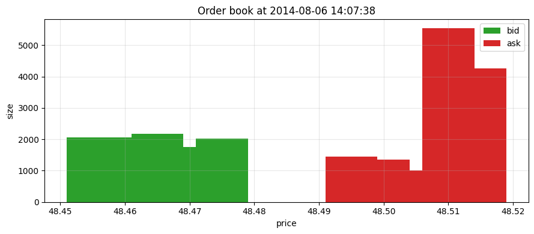
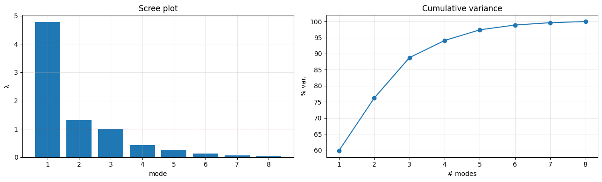

# Order-Flow Modelling of the Limit Order Book

**PCA & VAR applied to TotalEnergies (TOTF) trade & order-book data.**

Predict the dynamics of the limit order book (order flows and price) from its recent
past. The order flow between two significant price moves is summarised into 8 variables,
reduced to a handful of microstructure **modes via PCA**, and modelled with a **VAR**.

> Simplified version of Chapter 3 of S. Elomari's thesis, applied to the TotalEnergies
> stock (Euronext, ticker `TOTF`).

The notebook is written to be read through its **text alone**: every step and every
figure is explained with the template *Goal → Method / Maths → Figure / Reading*.

## Pipeline

```
book + trades → 6 order flows (price-keyed) → events (significant price change) → Xₙ (8 vars)
→ intraday profile → binning → transformation → stationarity (per day)
→ PCA → VAR (AIC/BIC/HQIC + validation) → diagnostics → R² (test) → impulse responses
```

**Key modelling choices**
- **Flow per price level** — queues at a fixed price are comparable.
- A **significant price change** = a new bid reaching the old ask (a genuine, directional move).
- **Returns measured in ticks** — the natural microstructure unit.
- **Everything computed per day** — bounded memory, no overnight contamination.
- **Lag `p` chosen on a validation set** — the test set is touched only once.
- **Stationarity tested per day** — pooling can hide non-stationarity.

## Repository structure

| Path | Description |
|------|-------------|
| `EI-flow_modelisation.ipynb` | Main notebook — full analysis from raw data to VAR diagnostics, TCA and risk. |
| `generate_figures.py` | Standalone script reproducing the order-flow classification pipeline and core figures from the raw data. |
| `figure/` | The 24 figures exported from the notebook (see gallery below). |
| `.gitignore` | Excludes the raw data files, PDFs and notebook checkpoints. |

> **Note on data.** The raw inputs (`TOTF_book_*.csv.gz`, `TOTF_trade_*.csv.gz`) are **not
> included** — they range from tens of MB to ~1.8 GB and exceed GitHub's file-size limits.
> Place them in the repository root to re-run the notebook or `generate_figures.py`.

## Notebook contents

| § | Section |
|---|---------|
| 0  | Setup |
| 1  | Data — the book at one instant, mid-price trajectory |
| 1bis | Macro / historical context |
| 2  | Order flow (6 types) tracked **per price level** |
| 3  | Events: *significant price change* → vector `Xₙ` (heavy tails, correlations) |
| 4  | Stylised facts — market impact (square-root law) |
| 5  | Intraday profile (estimated on the train set) |
| 6  | Binning (per day) |
| 7  | Train / validation / test split + transformation |
| 8  | Stationarity, **per day** |
| 9  | **PCA** — microstructure modes |
| 10 | **VAR** — information criteria (AIC/BIC/HQIC) and validation |
| 11 | Diagnostics (+ bid/ask symmetry) |
| 12 | Performance (out-of-sample `R²`) |
| 13 | Impulse responses (IRF) |
| 14 | Transaction cost analysis — spread profile, slippage, resilience |
| 15 | Price signals — order-book imbalance, microprice, Kyle's λ |
| 16 | Volatility & risk — RV signature, intraday clustering, extreme regimes |

## Selected figures

The limit order book at a single instant, and the PCA microstructure modes:




All 24 figures live in [`figure/`](figure/).

## Running it

Requirements (Python 3.10+):

```bash
pip install numpy pandas matplotlib scikit-learn statsmodels numba
```

Then, with the raw `TOTF_*.csv.gz` files placed in the repository root:

```bash
# Full analysis
jupyter notebook EI-flow_modelisation.ipynb

# Or just regenerate the core figures from the command line
python generate_figures.py
```

## Reference

S. Elomari, *Modélisation et calibration du carnet d'ordres* — Chapter 3 (order-flow
modelling), the methodology this project adapts to TotalEnergies.
